# I Heart Logs 笔记

- [1 Introduction](#1)
- [2 Data Integration](#2)
- [3 Logs and Real-Time Stream Processing](#3)
- [4 Building Data Systems with Logs](#4)

&nbsp;  

## 1 Introduction

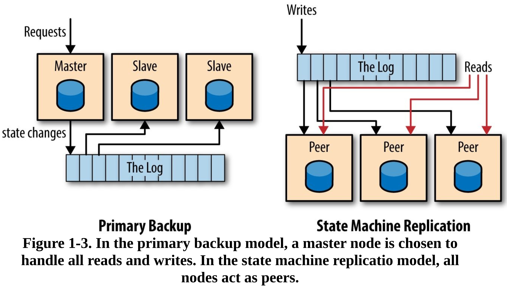

&nbsp;  

## 2 Data Integration

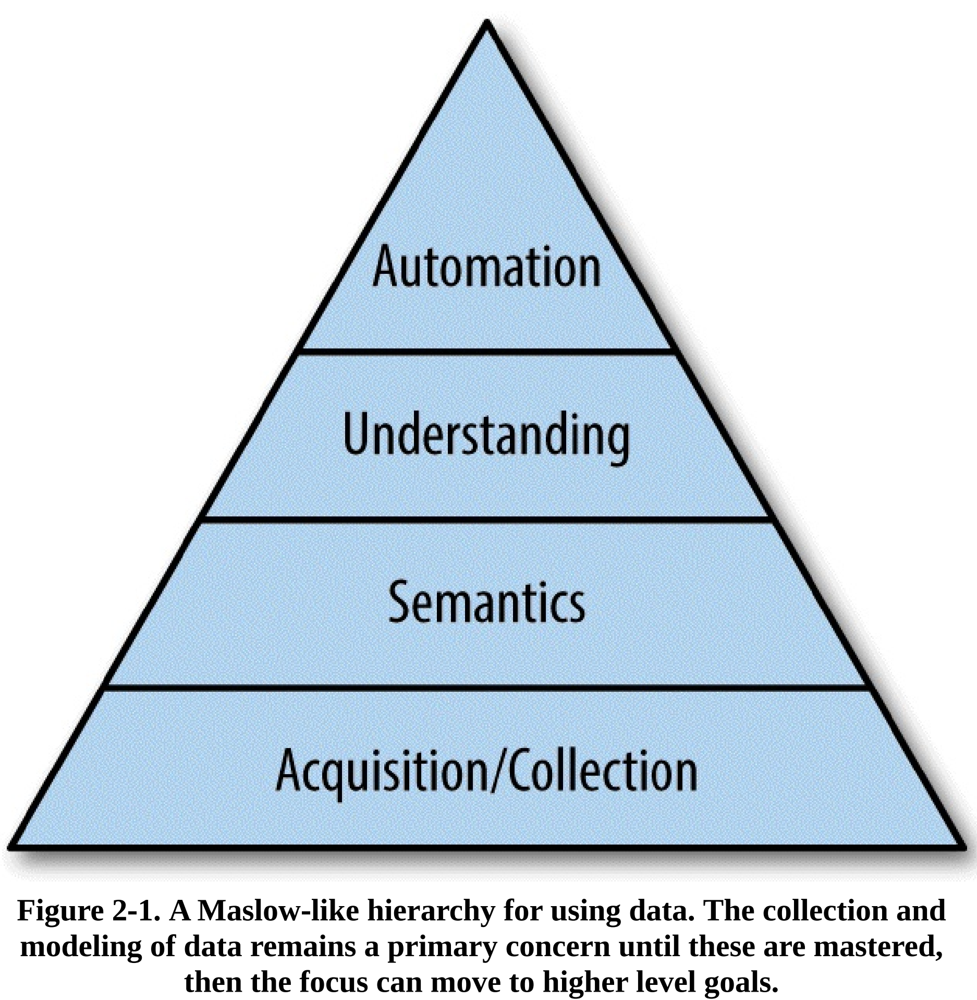

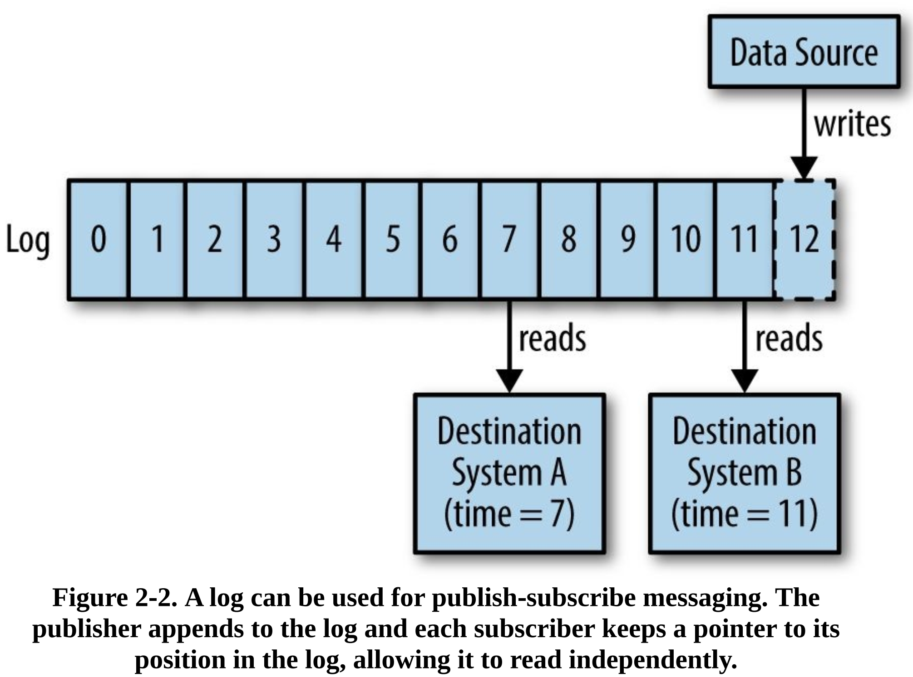

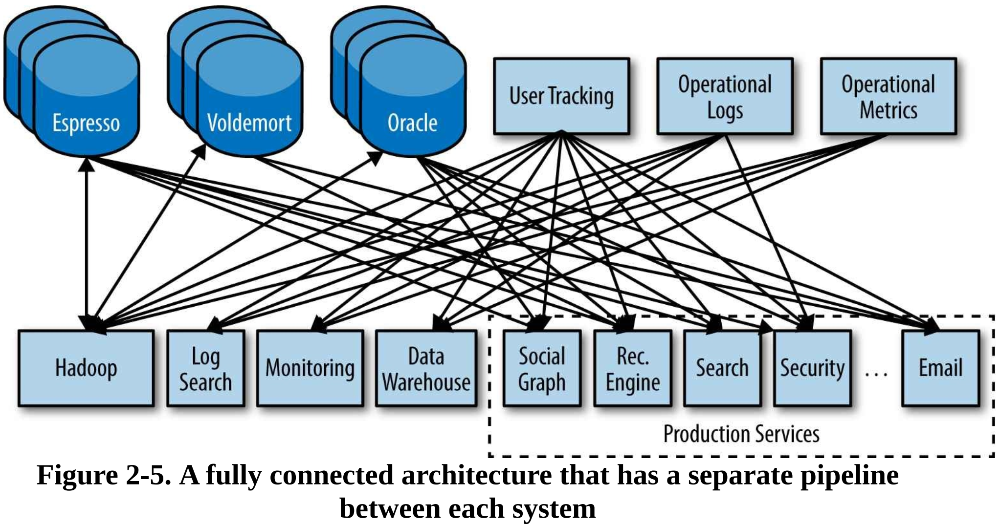

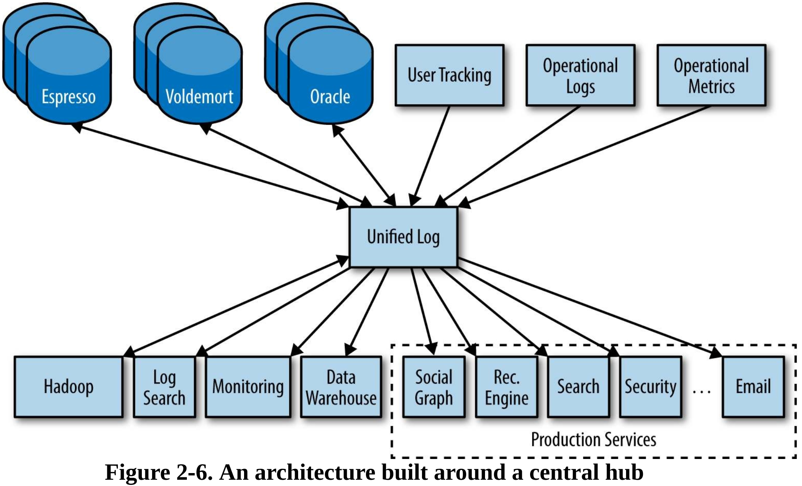

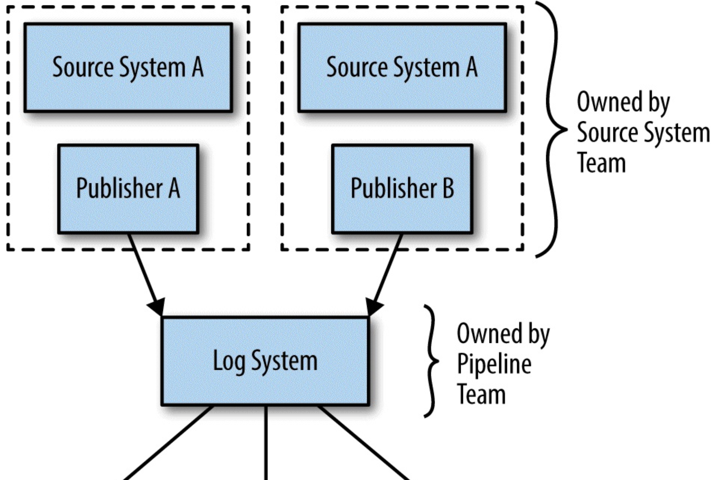
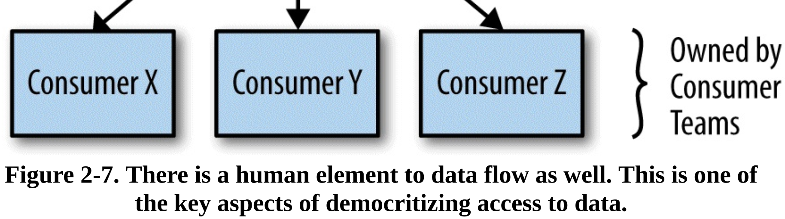

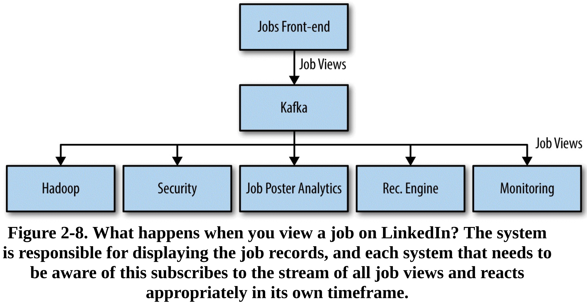

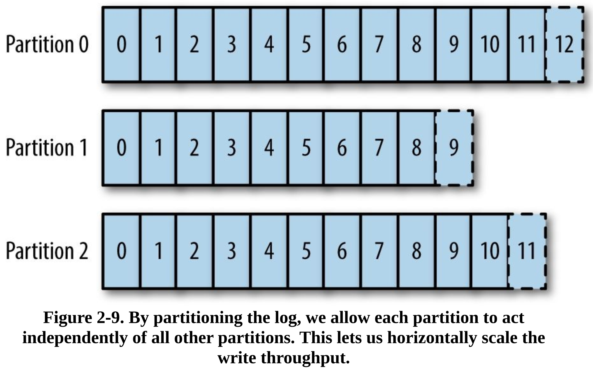

&nbsp;  

## 3 Logs and Real-Time Stream Processing

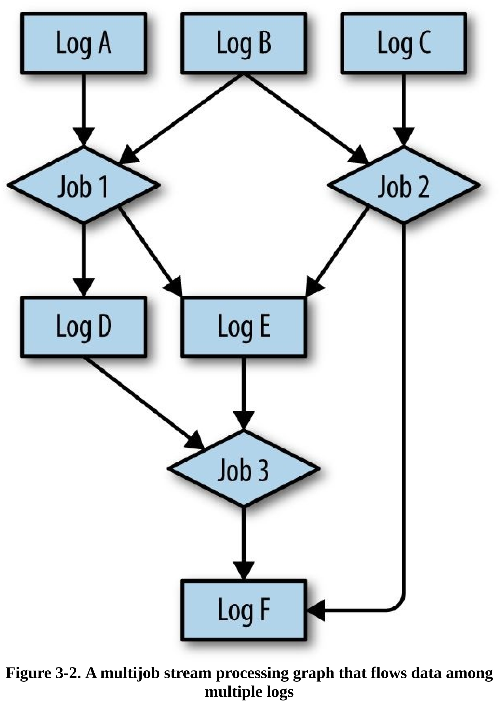

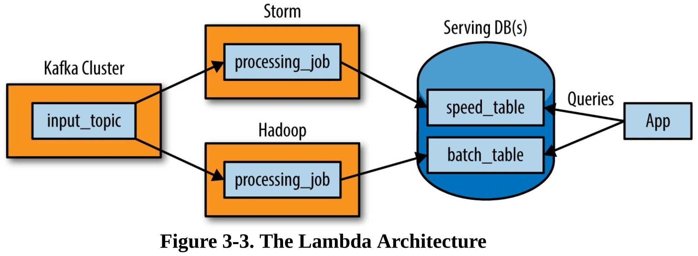

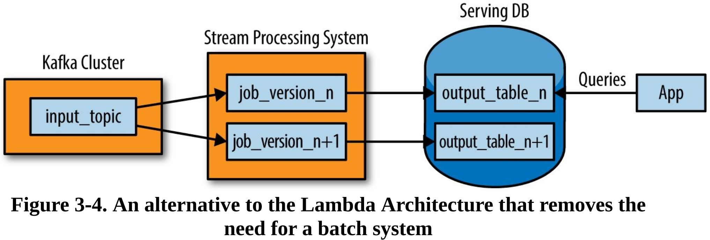

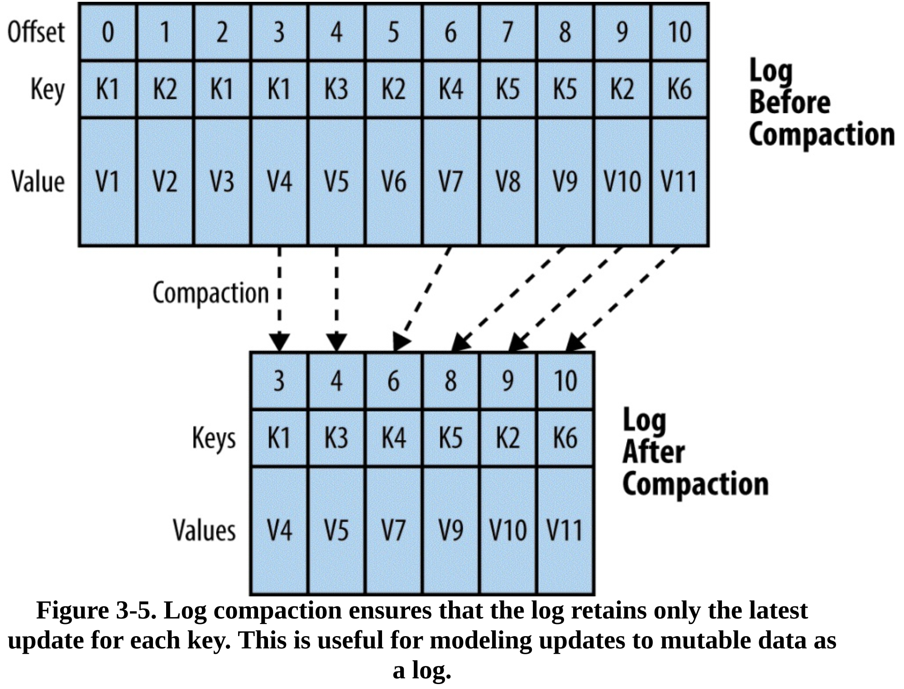

&nbsp;  

## 4 Building Data Systems with Logs

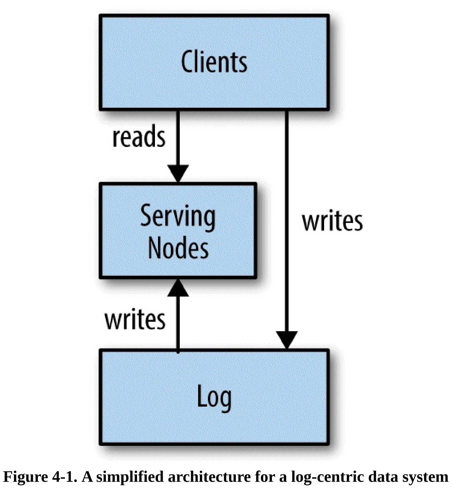

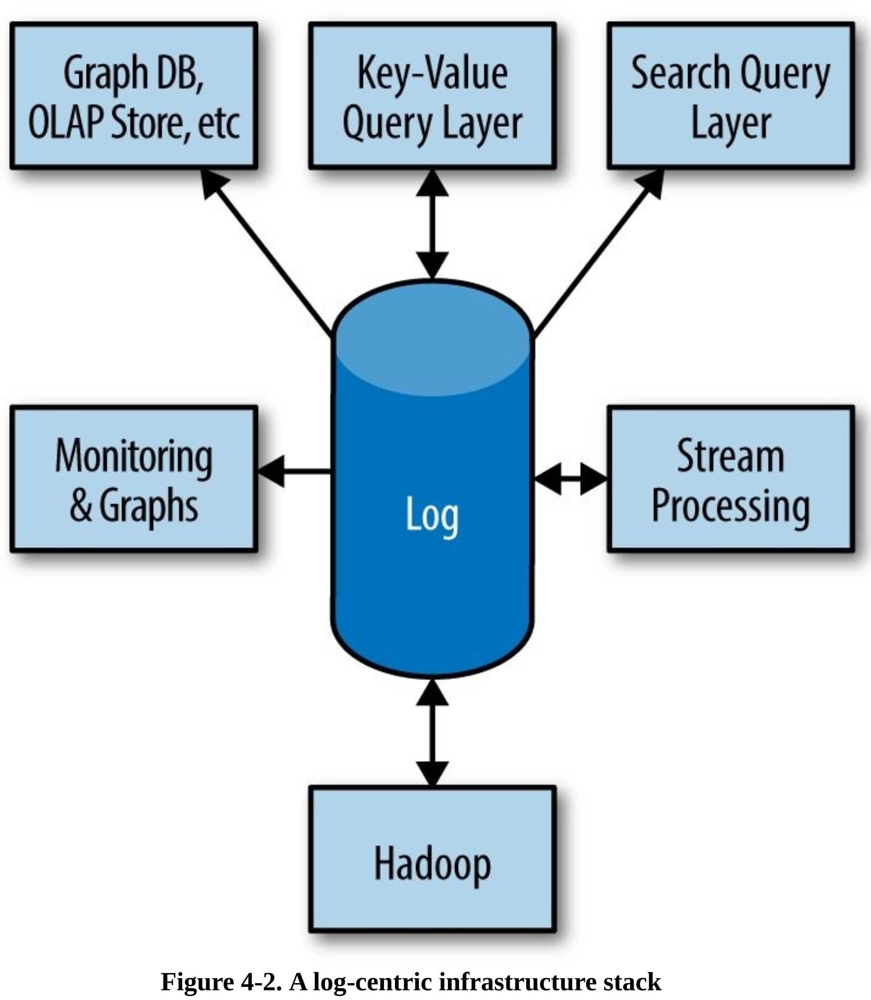

