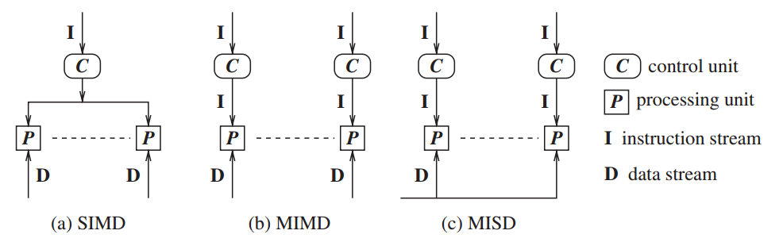

# 分布式计算 ——原理、算法与系统

# Distributed Computing —— Principles, Algorithms, and System

&nbsp;   

- [第一章 引言](#1)
- [第二章 分布式计算模型](#2)
- 
- 

&nbsp;   

## 第一章 引言

分布式系统：处理器、存储器、通信网络

### 1.4 与并行多处理器/多计算机系统的关系

#### 并行系统：通过将计算任务在多个处理器之间进行分配，从而获得更高的吞吐率

- 多处理器系统
  - 互联网络：Omega网络、蝴蝶网络

> 图左是UMA（均匀存储器访问体系结构），右NUMA

- 多计算机并行系统
  - 处理器无法直接访问共享内存
  - 互联网络：环，超立方体

- 阵列处理器

#### 基于指令流和数据流的分类

### 1.5 消息传递系统与共享内存系统的对比

- 通过消息传递进行通信
- 通过共享内存通信

#### 在消息传递系统上仿真共享内存

每一个共享的位置可以建模为一个隔离的进程。

处理器间通过共享内存进行通信；计算机间使用消息传递进行通信。

### 1.6 分布式通信的原语

消息发送原语`Send()`， 消息接受原语`Receive()`。

`Send()`发送方式：缓冲（拷贝到内核缓冲区，再到网络）与 非缓冲（直接拷贝到网络）。

`Receive()`通常采用缓冲方式。

- 同步原语：如果`Send()`和`Receive()`两端都实现了握手，则原语是同步的
  - 只有调用者知道对应的`Receive()`原语被调用并且接受操作完成，`Send()`原语才算完成
  - 当数据拷贝到接收方的用户缓冲区时，`Receive()`原语被认为完成
- 异步原语：
  - 如果需要发送的数据被拷贝出用户缓冲区后，控制流程返回到调用进程，`Send()`原语被称为异步的
  - 异步的`Receive()`原语无意义
- 阻塞原语：如果一个原语的处理完成之后控制流程返回到调用进程，则一个原语被称为阻塞的
- 非阻塞原语：如果一个控制流程在调用原语之后立刻返回到调用进程，甚至这个操作尚未完成，则这个原语被称为非阻塞的

[怎样理解阻塞非阻塞与同步异步的区别？- 知乎](https://www.zhihu.com/question/19732473)

#### 处理器同步性

**同步屏障**：保证在所有处理器完成前面所分配的指令之前都不会去执行下一步的代码。

### 1.7 同步与异步执行

#### 异步执行

- 没有处理器的同步
- 消息延迟（传输+传播时间）是有限的
- 对于一个进程执行某一步任务没有时间上的上界限制

#### 同步执行

- 处理器之间同步
- 消息分发（传输+分发时间）能够在一个逻辑步或者轮次内完成
- 进程执行一步具有一个已知的上界

同步系统实际上是一个特殊的异步系统——所有的通信都在其发起的轮次内完成。

#### 1.7.3 仿真

在无错误的系统中，异步/同步 共享内存/消息传递 这4类程序可以互相仿真，即等价。

但是在有错误的系统中，情况并不是这样；一个同步系统相比于异步系统具有更高的可计算性。

### 1.8 设计主题与挑战

#### 1.8.1 系统角度

- 通信：远程过程调用、远程对象调用、面向消息的通信、面向流的通信
- 进程
- 命名：对于资源和进程的标识以及定位
- 同步：leader, logic clock
- 数据存储与访问
- 一致性与复本
- 容错

#### 1.8.2 算法角度

&nbsp;   

## 第二章 分布式计算模型

在分布式系统中，通信消息可能在传递过程中**乱序**、**丢失**、**受到篡改**或者**重复传递**。

分布式系统可以以一个有向图的方式建模，其中结点表示处理器而边则表示单向通信信道。

### 2.1 分布式程序

分布式程序有一组 $n$ 个异步进程 $p_1,\ p_2,\ ...,\ p_n$ 组成，令 $C_{ij}$ 表示从进程 $p_i$ 到进程 $p_j$ 的通信信道，$m_{ij}$ 表示由 $p_i$ 发往 $p_j$ 的消息。

- 假设每个进程都各自运行在不同的处理器上
- 进程间没有可共享的全局存储，而只能通过消息传递来进行联系
- 通信延迟是有限但无法预测的
- 这些进程不共享一个可随时访问的全局时钟
- 进程运行和消息传送是异步的

### 2.2 分布式运行模型

一个进程的运行可以描述为三类*原子*操作：**内部事件**、**消息发送事件**、**消息接受事件**。令 $e_i^x$ 表示进程 $p_i$ 上的第 $x$ 个事件。对一个消息 $m$，令 $send(m)$ 和 $rec(m)​$ 分别表示其发送和接收的消息。一个内部事件改变其所处的进程的状态，一个发送或接受事件改变双方的状态。

进程中的事件以出现顺序进行排序：$e_i^1,\ e_i^2,\ ...,\ e_i^x,\ ...$，该序列记为 $\mathcal{H}_i$：
$$
\mathcal{H}_i = (h_i, \to_i)
$$
其中 $h_i$ 是由 $p_i$ 产生的事件集合；二元关系 $\to_i$ 则定义了这些事件间的序。

关系 $\to_{msg}$ 表示因消息交换所导致的因果依赖关系：
$$
send(m) \to_{msg} rec(m)
$$

#### 1. 因果优先关系

令 $H = \bigcup h_i$ 表示在一次分布式计算过程中执行的时间集合。我们在集合 $H$ 上定义一个关系 $\to$，表示事件间的因果依赖关系。
$$
\begin{aligned}
\forall e_i^x, \forall e_j^y \in H, e_i^x \to e_j^y \Leftrightarrow 
\begin{equation}
\left\{
        \begin{array}                        \\
            (i = j) \wedge (x < y) \qquad\qquad\qquad or \qquad &\cdots\ same\ process\\
            e_i^x \to_{msg} e_j^y \qquad\qquad\qquad\quad\quad\ or &\cdots\ direct \\
            \exist e_k^z \in H: e_i^x \to e_k^z \wedge e_k^z \to e_j^y &\cdots\ indirect \\
        \end{array}
\right.
\end{equation}
\end{aligned}
$$
关系 $\to$ 是 Lamport 的 “happerns before” 关系。**如果 $e_i \to e_j$，则事件 $e_j$ 直接或间接依赖于 $e_i$**，存在着一条起始于 $e_i$，终止于 $e_j$ 的路径。

$e_i \nrightarrow e_j$ 表示事件 $e_j$ 不直接或间接依赖于 $e_i$，**即事件 $e_i$ 不会对 $e_j​$ 产生因果影响**。

**并发**：如果 $e_i \nrightarrow e_j$ 且 $e_j \nrightarrow e_i$，则事件 $e_i$ 和 $e_j$ 被称为是并发的，其关系被记为 $e_i || e_j$。

#### 2. 逻辑并发和物理并发

两个事件是*逻辑并发*的，当且仅当它们之间无因果影响。与此相对，*物理并发*的含义是不同事件在物理时间的同一时刻发生。不论一组逻辑并发的事件是否在物理时间上同时发生，也无论它们在物理时间上实际发生的顺序如何，都不会改变计算的结果。因此。虽然**一组逻辑并发的事件**可能不会在物理时间的同一时刻发生，但我们**总是假定这些事件在物理时间的同一时刻发生**。

### 2.3 通信网络模型

**因果依赖**（CO）：对任意两个消息 $m_{ij}$ 和 $m_{kj}$，假设 $send(m_{ij}) \to send(m_{kj})$，则 $rec(m_{ij}) \to rec(m_{kj})$。确保那些发往同一目标的因果依赖的消息，以符合它们之间因果依赖关系的顺序进行发送。

通信网络模型：CO $\subset$ FIFO $\subset$ 非FIFO（随机）

因果依赖模型提供了一个内在的同步机制。

### 2.4 分布式系统的全局状态

&nbsp;   

##

&nbsp;   

##

&nbsp;   

##
