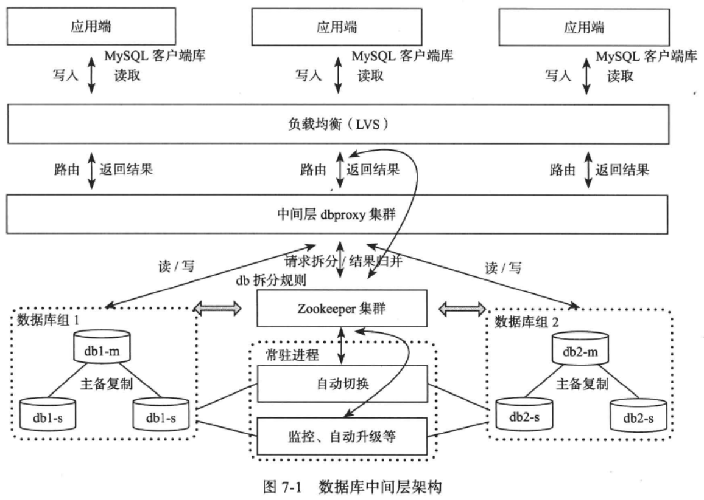

# [大规模分布式存储系统—原理解析与架构实战]() 学习笔记

- [1 概述](#1)
- [3 分布式系统](#3)
- [4 分布式文件系统](#4)
- [5 分布式键值系统](#5)
- [6 分布式表格系统](#6)
- [7 分布式数据库](#7)

&nbsp;   

## 概述

- partition
- consistency
- backup / replication
- load balance
- txn / concurrency control
- compression

&nbsp;   

## 分布式系统

### data placement

- hash
- sorted

### replication

基于 replicated log 的 state machine

- master-base protocol
  - sync
  - async
- replicated-write protocol
  - NWR

### fault tolerance

- 故障检测：租约（假设有时钟同步）
  - 租约：对 “发生故障” 达成一致
- 故障恢复
  - 总控节点：备份，由高可用外部服务（chubby, zk）选主
  - 存储+服务节点：由总控节点检测到，并切换 master
  - 服务节点（存储层单独出去）：由总控节点检测到，并切换 master，新 master 从存储层加载数据索引

### scalibility

考虑 1. 节点故障后的恢复 2. 扩容的自动化程度和灵活程度

总控节点如果成为瓶颈，可以考虑分级

主从复制，水平拆分，垂直拆分

同构系统中每一个组内的节点服务相同的数据

为了实现线性可扩展性，存储节点之间是异构的。故障发生后，整个集群都可以参与故障恢复

### atomic commit protocol

- 2PC：分布式事务
- paxos：构建高可用的全局服务 / 数据副本

### 跨机房部署

问题：

- 数据同步
- 服务切换

方案：

- 集群整体切换：以机房为单位备份
- 单个集群跨机房：master 可以跨机房，总控节点管理副本分布
- paxos 选主副本：spanner 多个副本构成一个paxos组，降低对总控节点的依赖

&nbsp;   

## 分布式文件系统

- 存储大对象
- 作为分布式表格系统的持久化层

### GFS

[The Google File System 论文阅读笔记](https://github.com/rsy56640/paper-reading/tree/master/%E5%88%86%E5%B8%83%E5%BC%8F/GFS)

- 主控节点不负责数据传输，只负责元数据管理与交互
- 拥有租约的 chunk server 负责数据传输
- workload 主要是 sequential read 和 append
- 分离 data flow 和 control flow：优化数据传输
- chunk placement：网络拓扑，机架分布，磁盘利用率

### Taobao FS

- 针对 blob 存储
- 主控节点只维护 dataserver 管理的 block，具体位置信息被存储在客户端数据库
- 文件去重：hash

### Haystack

- Haystack 目录存储 照片id -> logical volume 的映射（怎么维护）

### 内容分发网络 (CDN)

- CDN：将网络内容发布到靠近用户的服务器节点
- DNS 在对域名解析时返回由CDN负载均衡系统选定的某个边缘节点的IP

&nbsp;   

## 分布式键值系统

### Dynamo

- 一致性hash 虚拟节点
- NWR + vector clock
- 容错
  - 临时故障：数据回传
  - 永久故障：Merkel 树同步

### Tair

- 主控结点
- 一致性hash
- 负载均衡与数据迁移

&nbsp;   

## 分布式表格系统

PK 有序

### Bigtable

- 构建在廉价的硬件之上，通过软件层面提供自动化容错和线性可扩展能力
- Bigtable 构建在 GFS 之上，作为文件系统的分布式索引层，由 Chubby 保证高可用
- 元数据表管理
- 负载均衡，线性可扩展

### Megastore

- 基于 Bigtable 提供数据库功能支持
  - 映射 Megastore 操作到 Bigtable（query plan）
  - 事务并发控制
      - redo 日志写到 Bigtable 中的1行，保证原子性
      - first-wirter-wins
  - 跨机房数据复制及读写优化
  - 高可用
      - 怀疑 master 宕机的情况下，允许使用 paxos 来实施写服务

### Azure

&nbsp;   

## 分布式数据库

### 数据库中间层

### Cloud SQL Server

### Spanner

[Spanner: Google's globally-distributed database 论文阅读笔记](https://github.com/rsy56640/paper-reading/tree/master/%E5%88%86%E5%B8%83%E5%BC%8F/Spanner)

&nbsp;   

## 