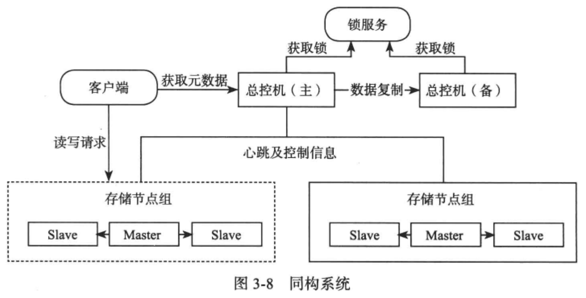

# [大规模分布式存储系统—原理解析与架构实战]() 学习笔记

- [1 概述](#1)
- [3 分布式系统](#3)
- 
- 

&nbsp;   

## 概述

- partition
- consistency
- backup / replication
- load balance
- txn / concurrency control
- compression

&nbsp;   

## 分布式系统

### data placement

- hash
- sorted

### replication

基于 replicated log 的 state machine

- master-base protocol
  - sync
  - async
- replicated-write protocol
  - NWR

### fault tolerance

- 故障检测：租约（假设有时钟同步）
  - 租约：对 “发生故障” 达成一致
- 故障恢复
  - 总控节点：备份，由高可用外部服务（chubby, zk）选主
  - 存储+服务节点：由总控节点检测到，并切换 master
  - 服务节点（存储层单独出去）：由总控节点检测到，并切换 master，新 master 从存储层加载数据索引

### scalibility

考虑 1. 节点故障后的恢复 2. 扩容的自动化程度和灵活程度

总控节点如果成为瓶颈，可以考虑分级

主从复制，水平拆分，垂直拆分

同构系统中每一个组内的节点服务相同的数据

为了实现线性可扩展性，存储节点之间是异构的。故障发生后，整个集群都可以参与故障恢复

### atomic commit protocol

- 2PC：分布式事务
- paxos：构建高可用的全局服务 / 数据副本

### 跨机房部署

问题：

- 数据同步
- 服务切换

方案：

- 集群整体切换：以机房为单位备份
- 单个集群跨机房：master 可以跨机房，总控节点管理副本分布
- paxos 选主副本：spanner 多个副本构成一个paxos组，降低对总控节点的依赖

&nbsp;   

## 